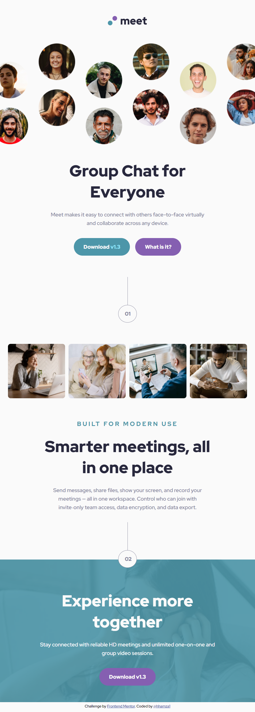
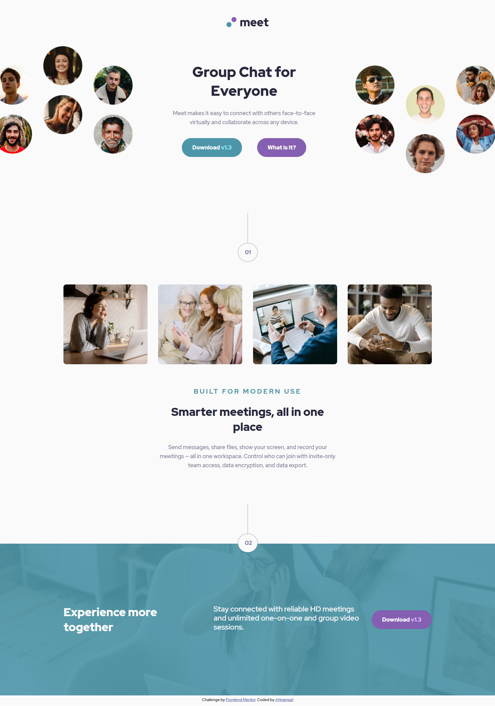
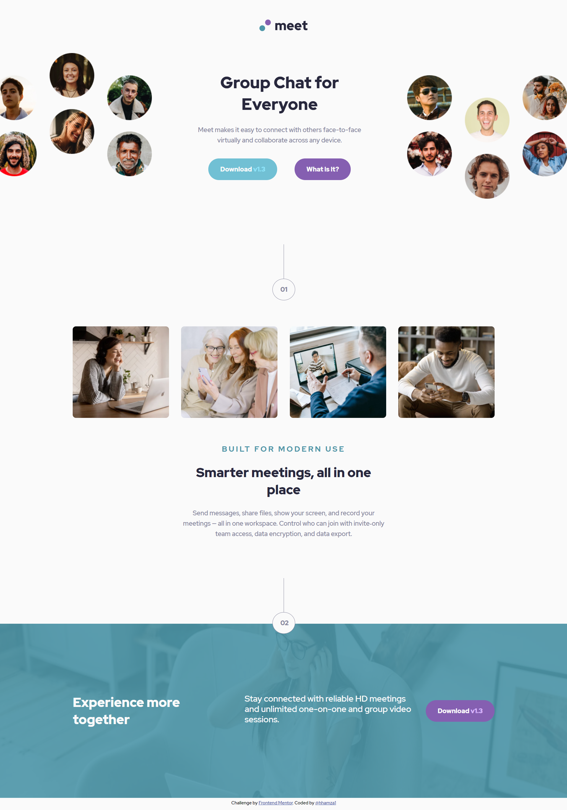

# Frontend Mentor - Meet Landing Page

This is a solution to the [meet landing page challenge on Frontend Mentor](https://www.frontendmentor.io/challenges/meet-landing-page-rbTDS6OUR)

## Table of contents

- [Overview](#overview)
  - [The challenge](#the-challenge)
  - [Screenshot](#screenshot)
  - [Links](#links)
- [My process](#my-process)
  - [Built with](#built-with)
- [Author](#author)

## Overview

### The challenge

Users should be able to:

- View the optimal layout depending on their device's screen size
- See hover states for interactive elements

### Screenshot

#### Mobile View

#### Tablet View

#### Desktop View

#### Desktop View - Active state

### Links

- Solution URL: [Github Repo](https://github.com/hhamza1/fem-meet-landing-page)
- Live Site URL: [Live Preview](https://hhamza1.github.io/fem-meet-landing-page/)

## My process

### Built with

- HTML
- CSS
- Mobile-first workflow
- Flexbox
- Grid

## Author

- Website - [Hamza H.](https://roverhollow-yetqlu-3881733548360.stormkit.dev/)
- Frontend Mentor - [@hhamza1](https://www.frontendmentor.io/profile/hhamza1)
- Twitter - [@Hamza80780203](https://twitter.com/Hamza80780203)